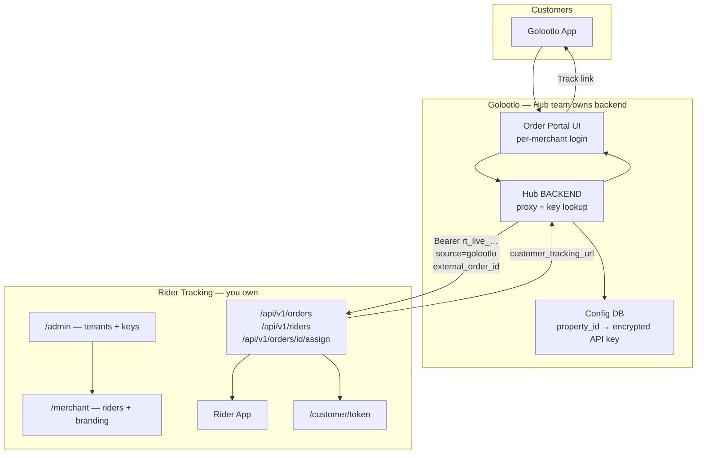
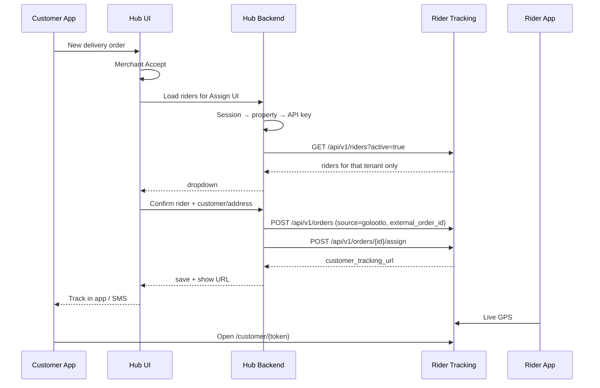
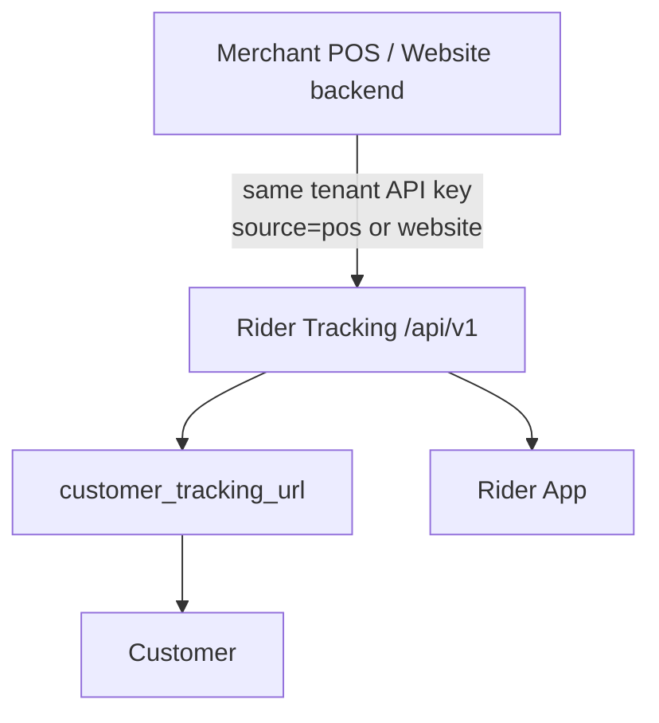
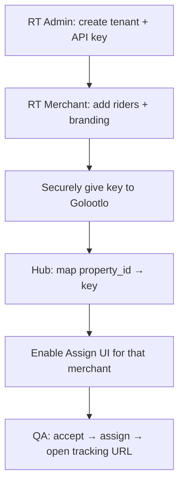

# Golootlo ↔ Rider Tracking — Integration Plan

Embed/iframe path was **removed**. Production integration is **API-key based** only: Golootlo Hub backend stores per-merchant keys and proxies to Rider Tracking API `/api/v1/*` (the **API host**, e.g. `https://api.example.com` / `NEXT_PUBLIC_API_URL` — not the Next.js portal origin).

---

## Principle

| Rule | Detail |
|------|--------|
| One Golootlo merchant / property | One Rider Tracking tenant + **one** API key |
| Keys never in the browser | Hub **server** proxy only |
| `source: "golootlo"` | Channel label only (not which tenant) |
| Tenant identity | Which API key Hub picks from the logged-in property |

Wrong example (rejected): California logged into Hub but Tim Hortons cookie/key used for assign.

---

## Big picture



---

## Flow 01 — Golootlo Order Portal



---

## Flow 02 — Merchant POS / website



Same three APIs; only caller and `source` change. Same tenant as Golootlo for that brand.

---

## Ownership

| Work | Owner |
|------|--------|
| `/admin` tenants + API keys | Rider Tracking (you) |
| `/merchant` riders + branding | Rider Tracking (you) |
| `/api/v1/orders`, `/riders`, `/assign` | Rider Tracking (you) — **ready** |
| Key store + Hub proxy routes | **Golootlo Hub team** |
| Assign UI → Hub proxy (no iframe) | **Golootlo Hub team** |
| Customer link in Golootlo App | Golootlo |

You do **not** need Hub backend access to finish the RT side. Hand them this doc + staging URL + test keys.

---

## API contract (Hub backend → Rider Tracking)

**Base URL:** staging/production Rider Tracking host  
**Header:** `Authorization: Bearer rt_live_…`

### 1. List riders
`GET /api/v1/riders?active=true`

Optional: `available=true|false`

### 2. Create order
`POST /api/v1/orders`

```json
{
  "customer_name": "Ali",
  "customer_phone": "03001234567",
  "delivery_address": "DHA Phase 5, Karachi",
  "address_detail": "optional",
  "delivery_lat": 24.8,
  "delivery_lng": 67.0,
  "source": "golootlo",
  "external_order_id": "330889",
  "rider_id": "optional-uuid-for-create-and-assign"
}
```

Phone: Pakistani mobile (`03XXXXXXXXX` or `+923XXXXXXXXX`).

### 3. Assign / reassign
`POST /api/v1/orders/{orderId}/assign`

```json
{
  "rider_id": "uuid",
  "confirm_reassign": false,
  "source": "golootlo"
}
```

Success response includes:

- `status: "ok"`
- `order`
- `assignedRider: { id, name }`
- `customer_tracking_url`

### Useful error statuses

| Status | HTTP | Meaning |
|--------|------|---------|
| `unauthorized` | 401 | Bad/missing API key |
| `invalid_phone` | 400 | Phone format |
| `rider_not_found` | 404 | Rider not in this tenant |
| `needs_confirmation` | 409 | Reassign without `confirm_reassign: true` |
| `order_closed` | 409 | Delivered/cancelled |
| `rate_limited` | 429 | Too fast |

Idempotency: same `external_order_id` for a tenant can reuse the order row on create/assign paths where implemented.

---

## Hub backend checklist (Golootlo team)

1. Config: `golootlo_property_id → api_key` (encrypted), `enabled`
2. From session resolve current property/merchant
3. Proxy routes (keys server-side only):
   - `GET /api/rider-tracking/riders`
   - `POST /api/rider-tracking/orders`
   - `POST /api/rider-tracking/orders/:id/assign`
4. No mapping → “Rider Tracking not connected”
5. UI: Assign rider modal — **no iframe**, call Hub proxies
6. Persist `customer_tracking_url` (+ RT `order.id`) against Golootlo order id

---

## Onboarding one merchant



---

## Phases

| Phase | What |
|-------|------|
| **Done (RT)** | `/api/v1` + admin/merchant; embed removed; this handoff doc |
| **Hub team** | Key map + proxy + Assign UI |
| **QA** | Two merchants (e.g. California vs Tim Hortons) — keys must not cross |
| **Later** | Webhooks, SMS provider, optional `golootlo_property_id` on `tenants` |

---

## Explicitly out of scope (removed)

- `/embed/assign` iframe
- postMessage Hub ↔ RT
- Merchant cookie login inside Hub modal
- Shared single API key for all Golootlo merchants
